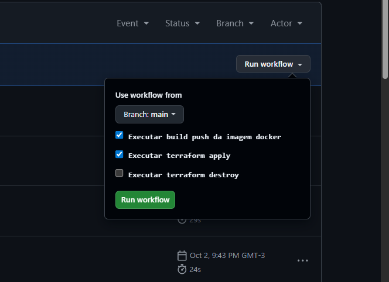

# Teste Técnico Analista DevOps 🚀 

        

Repositório de teste técnico para Analista DevOps.  
Objetivo:  
- Containerizar uma aplicação simples em PHP seguindo boas práticas para construção da imagem Docker 🐳  
- Criar pipeline de integração contínua (CI) usando GitHub Actions para build, push e checagem de vulnerabilidades da imagem ⚙️🔒  
- Provisionamento de infraestrutura na AWS usando Terraform como IaC 🏗️🌩️  
- Implantação e entrega da aplicação (CD) no ambiente provisionado integrando as pipelines de CI/CD ✅

---

### Etapa 1: Containerização da Aplicação 🧩
- `Dockerfile` configurado para uma aplicação simples em PHP com Laravel.  
- Imagem base: `php:8.3-fpm-alpine3.22` otimizada com poucos pacotes e vulnerabilidades reduzidas 🐚  
- Executado `apk update && apk upgrade` para mitigar vulnerabilidades conhecidas 🔧  
- Instalado e configurado `nginx` para servir a aplicação dentro do container ⚓  
- Adicionado `HEALTHCHECK` com `php-fpm-healthcheck` para validar estado do serviço ❤️‍🩹

---

### Etapa 2: Criação do Pipeline de Integração Contínua (CI) 🤖
Pipeline em GitHub Actions com as etapas principais:
- Checkout do código 📥  
- Login no Docker Hub 🔑  
- Build da imagem com tag baseada no hash do commit 🏷️  
- Push para Docker Hub (versão gerada + `latest`) 📦  
- Checagem de vulnerabilidades com Docker Scout 🔍

---

### Etapa 3: Infraestrutura como Código (IaC) e Implantação (CD) 🏗️➡️🚀
- Usando Terraform para IaC — arquivos em `terraform/` para provisionamento de cluster ECS com Fargate 🧭  
- Backend do Terraform armazenado em um bucket S3 (state remoto) 🗄️  
- Definições de tarefa em `terraform/task-definitions/task.json` com configuração da task do ECS 📝  
- Escolha do ECS por ser adequado para uma aplicação única, com suporte a escalabilidade e estabilidade 📈

---

### Pontos Importantes sobre o workflow no GitHub Actions 🔁
O workflow foi configurado para execução manual com alguns inputs:
- Executar build-push da imagem  
  - Se marcado sozinho, executa apenas o job CI 🛠️
- Executar `terraform apply`  
  - Se marcado sozinho, executa apenas o job CD para aplicar infra e implantar a task com a imagem `latest` 🌍
- Executar `terraform destroy`  
  - Se marcado sozinho, executa apenas o destroy para remover o ambiente ⚠️

Combinações possíveis:
- CI --> CD (build-push --> terraform apply) 🔗

---

### Etapa 4: Estratégia de Observabilidade 📊
Para observabilidade e monitoramento propus:
- Grafana para visualização, consultas e alertas 📈  
- Loki para logs da aplicação 🪵  
- Prometheus para métricas e criação de painéis de monitoramento 📡  
- Grafana Tempo para tracing (latência, gargalos) ⏱️
